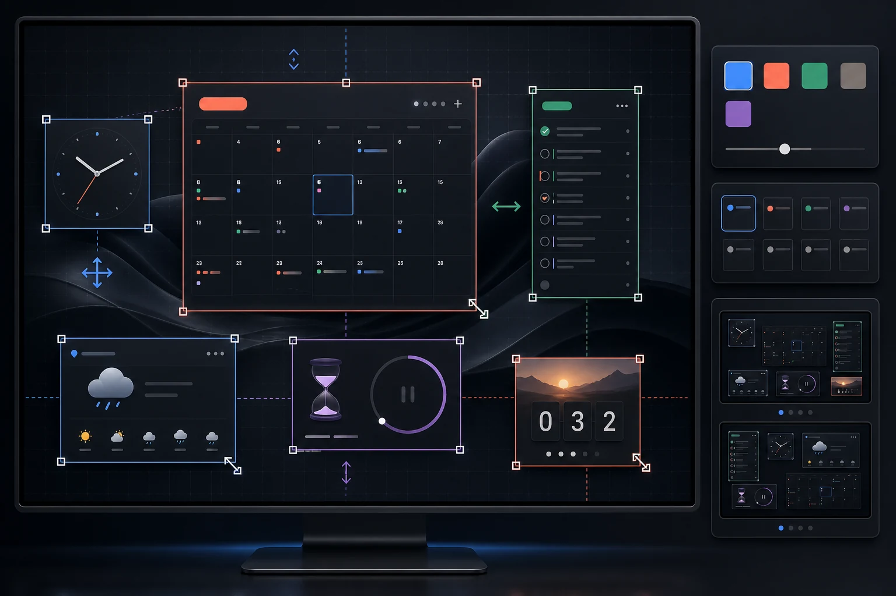

# Dark Calendar

Dark Calendar turns the Windows desktop into a personal time workspace. Place calendars, tasks, clocks, weather, D-Day, countdown, and text widgets directly on the desktop—then move, resize, recolor, and arrange them around the way you work.

[Official website](https://namer-kimhyojin.github.io/DARK-CALENDAR/) · [Microsoft Store](https://apps.microsoft.com/detail/9mxq08rf22k8) · [Latest release](https://github.com/Namer-kimhyojin/DARK-CALENDAR/releases/latest) · [Media kit](https://namer-kimhyojin.github.io/DARK-CALENDAR/promo.html) · [Campaign plan](marketing/DARK_CALENDAR_PROMOTION_KIT.md)



## Why Dark Calendar

- Put calendars and seven kinds of widgets directly on the Windows desktop.
- Move and resize each element freely, including multiple instances of the same widget.
- Build calendar-first, task-first, or widget-first layouts with custom colors and themes.
- Connect Google Calendar when needed, or keep schedules local to the PC.
- Plan tasks, run Pomodoro focus sessions, and review focus history in one workspace.
- Use the app in 19 interface languages, with Korean as the default.

## License

Dark Calendar is free software distributed under the **GNU General Public License v3.0 only** (`GPL-3.0-only`). See [LICENSE](LICENSE).

The application uses PyQt6, which is distributed by Riverbank Computing under GPLv3 or a commercial license. This repository uses the GPLv3 edition. Third-party components and their licenses are listed in [THIRD_PARTY_NOTICES.md](THIRD_PARTY_NOTICES.md).

## Corresponding source

- Source repository: <https://github.com/Namer-kimhyojin/DARK-CALENDAR>
- Release page for `3.6.7`: <https://github.com/Namer-kimhyojin/DARK-CALENDAR/releases/tag/v3.6.7>
- Complete corresponding-source archive: <https://github.com/Namer-kimhyojin/DARK-CALENDAR/releases/download/v3.6.7/DarkCalendar-3.6.7-corresponding-source.zip>
- Source availability notice: [SOURCE_OFFER.md](SOURCE_OFFER.md)

Each distributed binary must point to the matching release. The release must contain the application tag, exact dependency lock, license bundle, and complete corresponding-source archive used for that binary.

## Development

Requirements:

- Windows 10 or 11
- Python 3.12 or later

```powershell
python -m venv .venv
.venv\Scripts\python.exe -m pip install -r requirements.txt -r requirements-dev.txt
.venv\Scripts\python.exe main.py
```

Run the test suite:

```powershell
.venv\Scripts\python.exe -m pytest tests
python scripts/run_encoding_guard.py
```

Build the Windows package:

```powershell
python -m pip install -r requirements-build.lock
build-release.bat -Arch x64
```

Release builds must use `requirements-build.lock`; `requirements-runtime.lock` is the authoritative runtime dependency inventory. The build pipeline and PyInstaller specifications in this repository are part of the Corresponding Source.

## Data and credentials

Google OAuth credentials and tokens are supplied by each user and are not included in the repository or release payload. Do not commit `credentials.json`, `token.json`, local databases, logs, signing certificates, or API keys.

## Warranty

This program is provided without warranty, to the extent permitted by applicable law. See the GPLv3 text for details.
