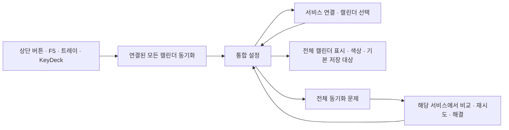

# 캘린더 동기화 기능 통합 — 2026-10-05

개발 작업 폴더의 Google 중심 진입점을 공통 동기화로 연결했습니다. Google·Outlook·iCloud·네이버·ICS 구독의 상태와 실행은 한곳에서 관리하고, 각 서비스의 인증과 고급 기능은 기존 세부 설정에 연결합니다.

## 사용자 흐름

| 진입점 | 연결 결과 |
|---|---|
| 상단 동기화 버튼 / F5 | 연결되고 캘린더가 선택된 서비스를 함께 실행. 실행할 서비스가 없으면 통합 설정 열기 |
| 상단 버튼 펼침 / 시스템 메뉴 / 트레이 / 우클릭 | 전체 실행, 통합 설정, 전체 문제 확인 |
| 캘린더 툴바 | 공통 동기화와 전체 캘린더 관리 |
| 명령 팔레트 / 기존 KeyDeck 동기화 키 | 공통 실행과 설정. 기존 저장 명령 ID 유지 |
| 서비스 카드 | 해당 서비스 설정, 개별 수동 동기화, 자동 동기화 토글, 문제 확인 |
| 전체 캘린더 | 로컬·공유·Google·Outlook·iCloud·네이버·ICS의 표시, 색상, 이름, 기본 저장 대상. 원격 선택은 서비스 세부 설정으로 연결 |
| 전체 동기화 문제 | 서비스별 충돌·전송 실패·삭제 실패 요약 → 해당 서비스 해결 화면 |
| ICS 문제 확인 | 실패한 구독을 선택하고 주소 확인·재동기화·구독 활성/비활성 변경 |

## 실행 및 안전 계약

- `CalendarSyncCoordinator`가 기존 엔진을 조정합니다. 서비스 간 자동 복사나 계정 통합은 수행하지 않습니다.
- 연결되지 않은 서비스, 선택한 캘린더가 없는 서비스, 이미 작업 중인 서비스는 중복 실행하지 않습니다. 한 서비스의 실행 실패가 다른 서비스 실행을 중단하지 않습니다.
- Google 로그인 버튼과 5탭 고급 설정은 Google 세부 설정에 유지합니다. Outlook 및 CalDAV 설정과 함께 통합 허브로 돌아갈 수 있습니다.
- Google의 기존 개별 전송 큐는 유지합니다. 생성·수정·이동·이름 변경·시간 변경 후 Outlook·iCloud 갱신은 800ms 묶어서 실행합니다. 자동 끄기·실패 재시도 대기·서비스별 작업 중 상태를 존중합니다.
- 기존 삭제 대기열의 `wake_gcal_sync()` 호출도 공통 조정기로 연결합니다. 읽기 전용 네이버·ICS는 로컬 수정 후 전송하지 않습니다.
- 자동 동기화를 꺼도 계정과 로컬 일정을 유지합니다. 수동 버튼으로 명시적으로 실행할 수 있습니다. Google 즉시 전송 큐도 자동 끄기를 반영합니다.
- ICS는 Google 성공 여부와 독립적으로 작업 스레드에서 갱신합니다. 중복 실행, 작업 중 구독 제거·활성 변경, 종료 후 성공 기록을 방지합니다.
- 기존 시간대 키 `gcal_timezone`을 유지하며 공통 ICS 갱신에도 적용합니다. 종일 날짜와 시간대 없는 일정의 원래 시각은 유지합니다. ICS 실패 로그에 구독 URL과 서버 예외 원문을 남기지 않습니다.
- 읽기 전용·선택 해제 캘린더는 기본 저장 대상으로 지정하지 않습니다. 원격 캘린더 제거는 서비스 설정에서 처리합니다. 로컬·ICS 제거 확인은 기존 일정 보존을 안내합니다.

## 검증과 범위

- 관련 회귀 검사 결과는 `artifacts/sync-integration/*-tests.xml` 및 `validation.json`에 기록했습니다. 전체 번역 구조 검사에서 발견된 기존 날씨 키 누락은 별도 미해결 항목으로 남겼습니다.
- 실제 `OverlayApp`을 임시 DB·INI 설정으로 생성하고, Google이 꺼져 있는 상태에서 상단 버튼의 iCloud 호출을 검증했습니다. 계정 네트워크는 모의 호출로 대체했습니다. 정상 종료까지 확인했습니다.
- 한국어·영어 / 밝음·어두움 / 서비스·전체 캘린더·문제의 12개 화면을 렌더링했습니다. `render-results.json`에 화면 크기를 기록했습니다.
- 신규 공통 문구 47개를 19개 로케일에 추가했습니다. 한국어·영어를 검토했고 다른 언어에는 영어 기본 문구를 사용합니다. 필수 키와 플레이스홀더를 별도로 검사했습니다.
- 전체 로케일 구조 검사에는 이번 변경 외 날씨 키 9개의 17개 로케일 누락이 남아 있습니다. 해당 사용자 변경을 덮어쓰지 않았으며 동기화 키 검사와 분리해 기록합니다.
- 큰 Qt 테스트 묶음과 하위 프로세스 실행을 함께 수행할 때 Windows 네이티브 진단이 한 차례 출력되어, UI 검사와 Google 시작 검사를 별도 프로세스로 재검증했고 통과했습니다.
- 실제 서비스 계정 인증·서버 호환, 릴리스 EXE, Microsoft Store 제출·설치 검증은 이 변경의 모의 검사로 확정할 수 없습니다. 이번 작업은 개발 폴더 구현이며 별도 배포를 수행하지 않았습니다.

## 화면 예시

## 후속 정정: 앱 실행의 설정 격리

이 기록의 앱 실행 스크립트는 임시 DB를 사용했으나 QSettings 기본 포맷만 변경해 Windows 실제 앱 설정에 테스트 값을 기록했다. 설정 격리 주장은 정정한다. 해당 스크립트를 명시적 임시 INI 실행으로 교체하고 실제 설정의 실행 전후 일치를 검증했다. 영향·복구 범위와 최종 동기화 검증은 [후속 개선](calendar-sync-followup-2026-10-05.md)에 기록했다.
