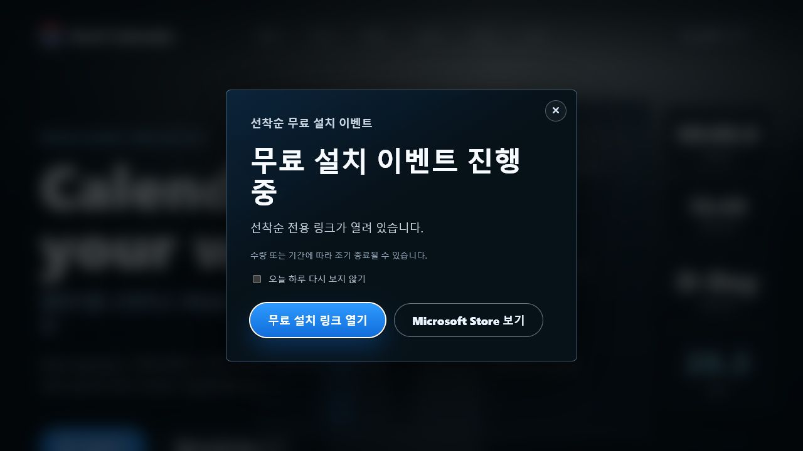
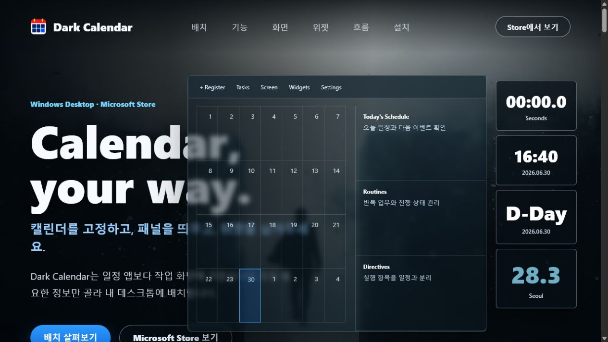
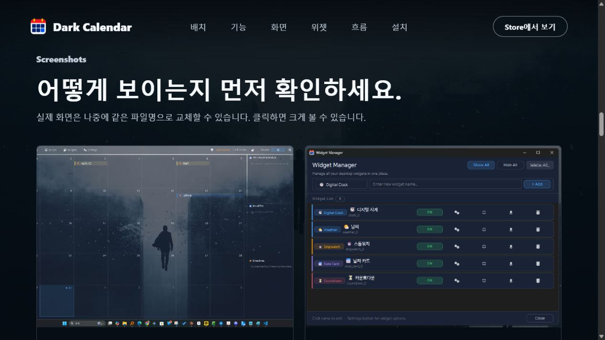
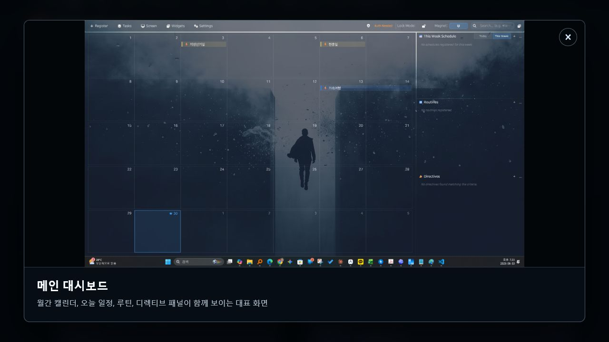
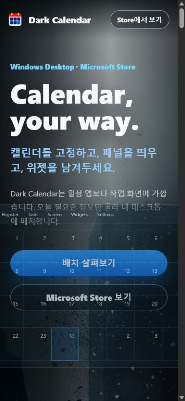

# Dark Calendar 홈페이지 UI/UX 개선안

- 점검일: 2026-07-13
- 범위: 첫 방문 → 제품 이해 → 화면 확인 → 설치 CTA
- 화면: 데스크톱 1280×720, 모바일 390×844
- 목표: 방문자가 10초 안에 제품 가치를 이해하고 신뢰한 뒤 Microsoft Store로 이동하게 만들기

## 총평

Dark Calendar 특유의 어두운 데스크톱 분위기와 제품 성격은 잘 드러납니다. 다만 현재는 제품 소개보다 이벤트 팝업이 먼저 나오고, 히어로의 제품 목업이 제목·설명·CTA와 겹치며, 모바일에서는 겹침이 더 심해집니다. 시각적 개성은 강하지만 구매·설치 전환을 위한 정보 우선순위와 반응형 안정성은 재정리가 필요합니다.

## 화면별 진단

### 1. 첫 방문 이벤트 팝업 — 주의 필요

- 강점: 제목, 보조 설명, 두 CTA의 대비가 명확합니다.
- 문제: 방문자가 제품을 이해하기 전 0.5초 뒤 전체 화면을 가립니다. “선착순 무료 설치”는 근거가 부족하면 신뢰를 떨어뜨릴 수 있습니다.
- 개선: 첫 방문 모달을 없애고 히어로 아래 인라인 배너로 전환합니다. 모달이 필요하면 50% 스크롤 이후 또는 재방문 때만 노출합니다.
- 접근성: 초기 포커스와 `Escape` 닫기는 있으나 포커스 트랩과 닫은 뒤 원래 위치로의 포커스 복귀가 없습니다.

### 2. 데스크톱 히어로 — 심각

- 강점: 어두운 배경, 앱 화면, 위젯 카드가 제품의 데스크톱 성격을 즉시 전달합니다.
- 문제: 1280px 화면에서 제품 목업이 H1과 본문을 덮고 CTA가 화면 아래에서 잘립니다. 제목도 “Calendar, your way.”로 일반적이어서 오버레이 캘린더·업무 위젯이라는 차별점이 바로 드러나지 않습니다.
- 개선: 절대 배치 대신 2열 그리드로 바꾸고, 왼쪽 메시지 44% / 오른쪽 실제 제품 화면 56%로 구성합니다. CTA는 첫 화면 안에 완전히 노출합니다.

### 3. 제품 화면과 확대 보기 — 보통

- 강점: 실제 제품 화면을 확대할 수 있고 이미지 대체 텍스트와 다이얼로그 이름이 제공됩니다.
- 문제: “실제 화면은 나중에 같은 파일명으로 교체할 수 있습니다”라는 제작 메모가 공개 문구로 노출됩니다. 스크린샷은 Windows 작업 표시줄, 배경 이미지, 작은 UI 텍스트가 함께 보여 제품 자체에 집중하기 어렵습니다.
- 개선: 제작 메모를 사용자 가치 문구로 교체하고, 앱 창만 16:10 비율로 다시 캡처합니다. 대표 화면 3개만 남기고 기능 포인트를 1~2개씩 짧게 주석 처리합니다.
- 접근성: 라이트박스도 포커스 트랩과 호출 요소로의 포커스 복귀가 없습니다.

### 4. 모바일 히어로 — 심각

- 강점: 로고와 Store CTA는 작은 화면에서도 식별됩니다.
- 문제: 데스크톱용 제품 목업을 축소·절대 배치해 설명문과 버튼, 캘린더가 서로 겹칩니다. 모바일 내비게이션은 완전히 사라지고 페이지 전체 길이는 약 16,785px로 과도합니다.
- 개선: 모바일에서는 제품 목업을 일반 문서 흐름의 단일 이미지로 전환합니다. 메시지 → CTA → 실제 화면 순서로 쌓고, 중복 섹션을 줄여 전체 길이를 절반 이하로 줄입니다.

## 우선순위

### P0 — 출시 전 필수

1. 모바일 히어로의 절대 배치·겹침 제거
2. 데스크톱 히어로를 2열 그리드로 재구성해 제목과 CTA 가림 해소
3. 첫 방문 이벤트 모달을 인라인 배너 또는 지연 노출로 변경
4. 공개된 제작 메모 문구 제거

### P1 — 전환과 신뢰 개선

1. H1을 제품 가치 중심으로 변경: `일정과 할 일을 바탕화면 한 곳에`
2. CTA 문구 통일: `Microsoft Store에서 무료 설치`
3. 히어로 아래에 `Windows 10/11`, `Microsoft Store`, `로컬 우선`, `Google Calendar 연동` 신뢰 정보 배치
4. 스크린샷을 앱 창 중심으로 재촬영하고 3개로 축소
5. 모바일에 간단한 메뉴 또는 `기능 보기` 보조 CTA 제공

### P2 — 접근성과 완성도

1. 모달·라이트박스 포커스 트랩, 배경 `inert`, 닫은 뒤 포커스 복귀 구현
2. 키보드 포커스 표시를 모든 링크·버튼에 일관되게 적용
3. 공개 푸터의 숨김 관리자 버튼 제거 또는 별도 비공개 경로로 분리
4. 한글/영문 기능명과 버튼 문구의 표기 규칙 통일

## 권장 페이지 구조

1. 헤더: 로고 / 제품 화면 / 기능 / FAQ / `Microsoft Store에서 무료 설치`
2. 히어로: 가치 제안 + 한 문장 설명 + 주 CTA + 실제 제품 화면
3. 신뢰 바: 플랫폼, Store 배포, 로컬 우선, Google Calendar
4. 핵심 가치 3개: 일정 보기 / 실행·집중 / 바탕화면 위젯
5. 제품 화면 3개: 탭 또는 가로 캐러셀
6. 사용 흐름 3단계: 확인 → 선택 → 집중
7. 개인정보·요구사항·FAQ
8. 최종 설치 CTA

현재의 `Hero benefits`, `Core Message`, `Visual Highlights`, `Widgets`, `Workflow`, `Details`, `For Users`는 내용이 반복되므로 위 구조로 통합하는 것이 좋습니다.

## 히어로 카피 예시

- 라벨: `Windows 데스크톱 캘린더 & 업무 위젯`
- 제목: `일정과 할 일을 바탕화면 한 곳에`
- 설명: `캘린더, 루틴, 집중 타이머, D-Day 위젯을 원하는 위치에 배치하고 오늘 해야 할 일에 바로 집중하세요.`
- 주 CTA: `Microsoft Store에서 무료 설치`
- 보조 CTA: `제품 화면 보기`

## 측정 지표

- 히어로 Store CTA 클릭률
- 첫 방문 이벤트 팝업 닫기율
- 제품 화면 섹션 도달률
- 모바일 이탈률
- Store 이동 전 평균 체류 시간

## 검증 한계

이번 점검은 로컬 홈페이지의 시각 화면, DOM 구조, 주요 상호작용과 관련 코드에 근거했습니다. 실제 Microsoft Store 진입 이후 설치 완료율, 스크린리더별 동작, 200% 확대와 다양한 실제 기기에서의 동작은 별도 검증이 필요합니다.
